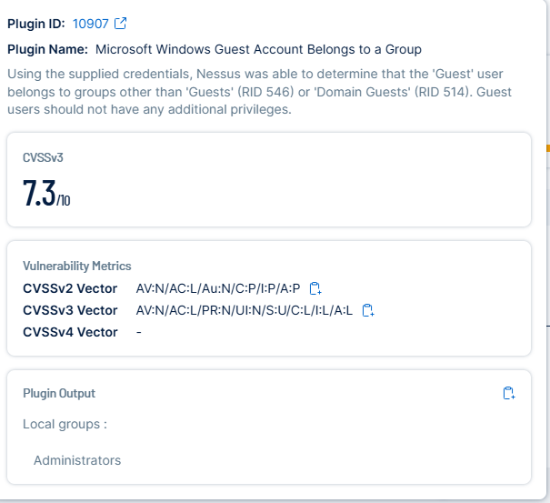
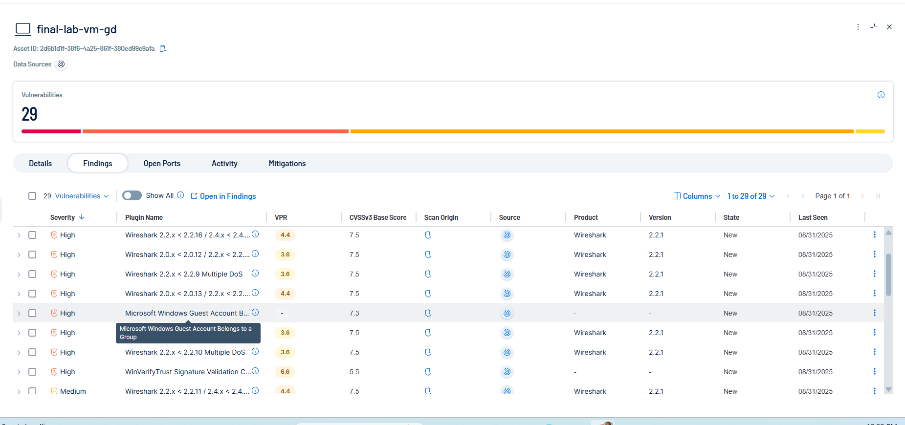

# STIG – Microsoft Windows Guest Account Belongs to a Group (Plugin ID: 10907)

## Before
- **Finding:** The `Guest` account is a member of privileged groups (e.g., Administrators, Domain Guests).  
- **Risk:** Guest accounts with elevated privileges can be exploited to gain unauthorized access and move laterally in the environment.  
- **Evidence:**  
    
    

---

## Remediation
- Remove the `Guest` account from all privileged groups (Administrators, Domain Guests, etc.).  
- Disable the `Guest` account if not required.  
- Validate changes by rescanning or checking group membership again.  

---

## After Remediation
- Guest account successfully removed from all privileged groups.  
- Verification performed via group membership review and Tenable rescan.  
- Screenshots (placeholders until updated with final evidence):  
  - GuestAccount-After-Details.png  
  - GuestAccount-After-FindingsList.png 
